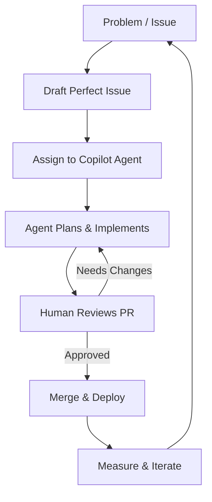
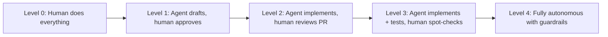
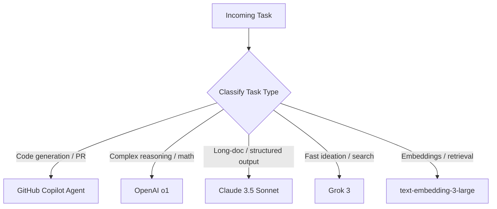
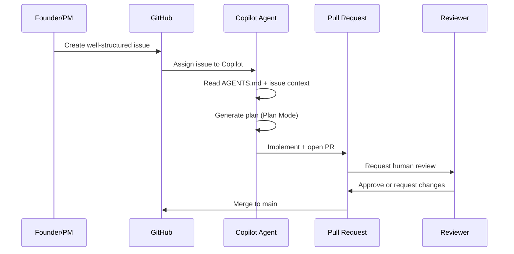
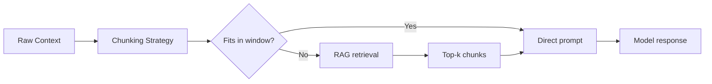
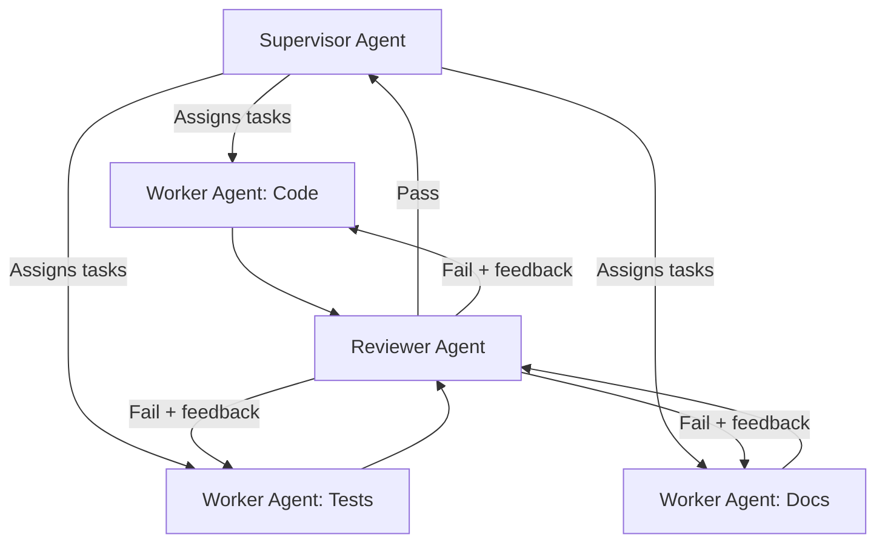
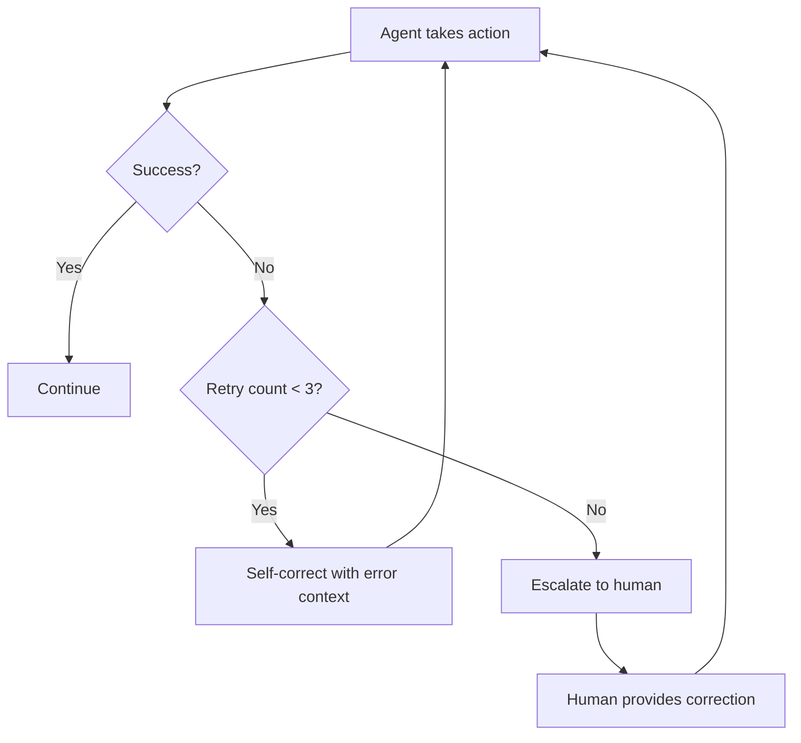

# SHReye AI Playbook v1.0
### The Ultimate Agentic AI Operating System for Founders & Teams

> **Version:** 1.0 | **Status:** Active | **Last Updated:** 2026-04-27  
> **Maintained by:** SHReye AI Team | **Assigned Agent:** GitHub Copilot (Coding Agent)

---

## Table of Contents

1. [Philosophy & Mental Models](#1-philosophy--mental-models)
2. [The SHReye AI Stack 2026](#2-the-shreye-ai-stack-2026)
3. [Issue → Agent → PR Workflow](#3-issue--agent--pr-workflow)
4. [Prompt Engineering Playbook](#4-prompt-engineering-playbook)
5. [Agent Orchestration Patterns](#5-agent-orchestration-patterns)
6. [Repo Hygiene & Standards](#6-repo-hygiene--standards)
7. [Templates & Ready-to-Use Assets](#7-templates--ready-to-use-assets)
8. [Metrics & Iteration](#8-metrics--iteration)
9. [Contribution Guidelines](#9-contribution-guidelines)
10. [Changelog](#10-changelog)

---

## Overview

This playbook is the **single source of truth** for how SHReye AI designs, orchestrates, deploys, and scales cutting-edge AI agents and agentic workflows. Think of it as our internal **Codex 2.0** – battle-tested, opinionated, and purpose-built to let every team member (human or agent) ship 10× faster while staying in full control.



---

## 1. Philosophy & Mental Models

> 📖 Full section: [playbook/01-philosophy.md](playbook/01-philosophy.md)

### 1.1 Why "44× Higher-Quality AI Agent Orchestration"

The 44× multiplier is not a marketing number – it's a compounding result of:

| Factor | Multiplier |
|---|---|
| Structured issues → precise agent context | 3× |
| AGENTS.md guardrails → fewer hallucinations | 4× |
| Chain-of-thought prompting → better reasoning | 2× |
| Multi-model routing → best model for each task | 1.5× |
| Human-in-the-loop review → zero regressions | 1.5× |
| RAG + memory → consistent outputs over time | 2× |
| **Compound total** | **≈ 44×** |

### 1.2 Human-in-the-Loop vs. Fully Autonomous

We operate on a **trust ladder**:



**Default operating mode: Level 2–3.** We never skip human review for production changes.

### 1.3 Our North Star

> **Understand the Universe → Ship Faster → Stay in Control**

- **Understand:** Deep domain knowledge before writing a single line of code or prompt
- **Ship Faster:** Agents handle the repetitive; humans handle the creative and critical
- **Stay in Control:** Every agent action is auditable, reversible, and bounded

---

## 2. The SHReye AI Stack 2026

> 📖 Full section: [playbook/02-stack.md](playbook/02-stack.md)

### 2.1 Core Tools

| Layer | Tool | Primary Use |
|---|---|---|
| **Coding Agent** | GitHub Copilot (Coding Agent) | Issue → PR automation |
| **Reasoning** | OpenAI o1 / o3 | Complex multi-step reasoning |
| **Instruction-Following** | Claude 3.5 Sonnet | Structured output, long context |
| **Speed / Breadth** | Grok 3 | Fast ideation, web-aware tasks |
| **Embeddings / RAG** | OpenAI text-embedding-3-large | Semantic search, context retrieval |
| **Orchestration** | LangGraph / CrewAI | Multi-agent pipelines |
| **Evaluation** | LangSmith | Agent tracing and eval |

### 2.2 Multi-Model Routing Strategy



### 2.3 When to Use Which Model/Agent

| Scenario | Recommended Model |
|---|---|
| Writing / refactoring code | GitHub Copilot |
| Architectural decisions | o1 + Claude (compare outputs) |
| Summarizing long documents | Claude 3.5 Sonnet |
| Real-time web research | Grok 3 |
| Semantic search over codebase | text-embedding-3-large + RAG |
| Multi-agent pipeline orchestration | LangGraph |

---

## 3. Issue → Agent → PR Workflow

> 📖 Full section: [playbook/03-issue-agent-pr-workflow.md](playbook/03-issue-agent-pr-workflow.md)

### 3.1 The Exact Flow



### 3.2 How to Draft Perfect Issues for Copilot

A high-quality issue has **7 essential components**:

1. **Clear title** – Action verb + noun + scope  
   `✅ Create user authentication module with JWT support`  
   `❌ Fix login`

2. **Problem statement** – Why this matters now

3. **Acceptance criteria** – Bullet checklist of what "done" looks like

4. **Technical constraints** – Stack, APIs, no-go areas

5. **Examples / references** – Links, screenshots, prior art

6. **Out of scope** – What the agent should NOT touch

7. **Labels** – `agent-ready`, priority, type

**Template:** See [playbook/07-templates.md#issue-template](playbook/07-templates.md#issue-template)

### 3.3 AGENTS.md Rules

Every repo must have an `AGENTS.md` at the root. It tells Copilot:
- How the repo is structured
- How to run tests and lints
- What it must/must not do
- Where to find context (playbook, docs, etc.)

See our canonical starter: [AGENTS.md](AGENTS.md)

### 3.4 Plan Mode → Implement → Review Loop

1. **Plan Mode** – Agent creates a checklist before touching any file
2. **Implement** – Agent makes minimal, surgical changes
3. **Validate** – Agent runs existing tests/lints
4. **PR opened** – Human reviews diff, not just intent
5. **Iterate** – Human comments → agent addresses → re-review

---

## 4. Prompt Engineering Playbook

> 📖 Full section: [playbook/04-prompt-engineering.md](playbook/04-prompt-engineering.md)

### 4.1 System Prompt Anatomy

Every system prompt must contain:

```
ROLE: <who the agent is>
CONTEXT: <what it knows>
TASK: <what it must do>
FORMAT: <how to respond>
CONSTRAINTS: <what it must not do>
EXAMPLES: <1-3 shots>
```

### 4.2 Core Prompting Patterns

| Pattern | When to Use | Example |
|---|---|---|
| **Chain-of-Thought (CoT)** | Multi-step reasoning | "Think step by step…" |
| **ReAct** | Tool use + reasoning interleaved | Observe → Think → Act loop |
| **Plan-and-Execute** | Long tasks with subtasks | Generate plan → execute each step |
| **Self-Critique** | Output quality | "Review your answer for errors…" |
| **Few-Shot** | Format consistency | Provide 2-3 examples before the task |

### 4.3 Context Window Mastery



**Rules:**
- Put the most important context at the **beginning and end** (primacy/recency effect)
- Keep system prompts under 2,000 tokens
- Use RAG for any corpus > 50 pages

---

## 5. Agent Orchestration Patterns

> 📖 Full section: [playbook/05-agent-orchestration.md](playbook/05-agent-orchestration.md)

### 5.1 Single Agent vs. Multi-Agent Teams

| Scenario | Architecture |
|---|---|
| Single, well-defined task | Single agent |
| Parallel workstreams | Multi-agent (parallel) |
| Sequential dependencies | Multi-agent (pipeline) |
| Quality assurance required | Supervisor + Worker + Reviewer |

### 5.2 Supervisor → Worker → Reviewer Hierarchy



### 5.3 Error Handling, Self-Correction & Human Escalation



**Escalation triggers:**
- 3 consecutive failures on the same step
- Confidence score below threshold
- Destructive action detected (delete, deploy to production)
- Cost exceeds per-task budget

---

## 6. Repo Hygiene & Standards

> 📖 Full section: [playbook/06-repo-hygiene.md](playbook/06-repo-hygiene.md)

### 6.1 Standard File Structure

```
repo-root/
├── AGENTS.md              # Copilot agent instructions
├── PLAYBOOK.md            # This document (or link to it)
├── README.md              # Human-facing intro
├── playbook/              # Detailed playbook sections
├── .github/
│   ├── ISSUE_TEMPLATE/    # Standardized issue templates
│   └── workflows/         # CI/CD pipelines
├── src/                   # Application source
├── tests/                 # Test suite (mirrors src/)
└── docs/                  # Additional documentation
```

### 6.2 Testing Requirements for Agent PRs

Every agent-generated PR **must** include or pass:

- [ ] Existing tests still pass (no regressions)
- [ ] New code has corresponding tests (≥ 80% coverage for new functions)
- [ ] Linter passes with zero new errors
- [ ] PR description explains *what* and *why*, not just *how*
- [ ] No secrets or credentials committed

### 6.3 Security & Cost Guardrails

| Guardrail | Implementation |
|---|---|
| No hardcoded secrets | Pre-commit hook + GitHub secret scanning |
| API cost limits | Per-agent token budget in orchestrator config |
| Destructive action approval | Human-in-the-loop gate before delete/deploy |
| Output validation | Structured output schemas (Pydantic / Zod) |
| Rate limiting | Exponential backoff on all external API calls |

---

## 7. Templates & Ready-to-Use Assets

> 📖 Full section: [playbook/07-templates.md](playbook/07-templates.md)

### 7.1 Quick Links

| Asset | Location |
|---|---|
| Issue template (agent-ready) | [.github/ISSUE_TEMPLATE/agent-task.md](.github/ISSUE_TEMPLATE/agent-task.md) |
| AGENTS.md starter | [AGENTS.md](AGENTS.md) |
| System prompt library | [playbook/07-templates.md#system-prompts](playbook/07-templates.md#system-prompts) |
| Sub-issue breakdown template | [playbook/07-templates.md#sub-issue-template](playbook/07-templates.md#sub-issue-template) |

---

## 8. Metrics & Iteration

> 📖 Full section: [playbook/08-metrics.md](playbook/08-metrics.md)

### 8.1 How We Measure Agent Velocity

| Metric | Target | Measured By |
|---|---|---|
| Issue → Merged PR (cycle time) | < 2 hours | GitHub Insights |
| PR acceptance rate (no major rework) | > 80% | PR review labels |
| Test coverage on agent PRs | > 80% | CI coverage report |
| Hallucination rate (incorrect implementation) | < 5% | Reviewer log |
| Cost per task (API tokens) | < $0.50 | LangSmith traces |

### 8.2 Weekly Playbook Retro Process

Every Friday, 15-minute sync:

1. **What worked?** – Agent wins this week
2. **What didn't?** – Failed PRs, escalations, high costs
3. **Playbook update?** – If a pattern keeps failing, update the relevant section
4. **Version bump?** – Minor version bump for any section change

---

## 9. Contribution Guidelines

### 9.1 How to Update This Playbook

1. Open a GitHub issue with label `playbook`
2. Assign to Copilot (or yourself)
3. Make changes in a branch named `playbook/<section>-<brief-description>`
4. Open a PR with the `playbook` label
5. Requires **1 human approval** before merge
6. Bump the version in this file and `CHANGELOG.md`

### 9.2 Versioning

We follow **SemVer for the playbook**:
- **MAJOR** – Fundamental philosophy or workflow change
- **MINOR** – New section or significant section revision
- **PATCH** – Typos, clarifications, template updates

### 9.3 Section Ownership

| Section | Owner | Cadence |
|---|---|---|
| Philosophy | Founder | Quarterly |
| Stack | Tech Lead | Monthly |
| Workflow | All | Weekly retro |
| Prompt Engineering | AI Lead | Bi-weekly |
| Orchestration | AI Lead | Monthly |
| Repo Hygiene | Tech Lead | Monthly |
| Templates | All | As-needed |
| Metrics | Founder + AI Lead | Weekly |

---

## 10. Changelog

See [playbook/CHANGELOG.md](playbook/CHANGELOG.md)

---

*SHReye AI Playbook v1.0 – Built with GitHub Copilot Coding Agent*  
*North Star: Understand the Universe → Ship Faster → Stay in Control* 🚀
