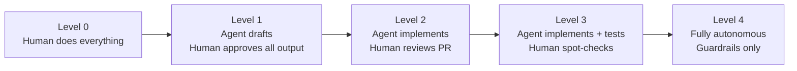
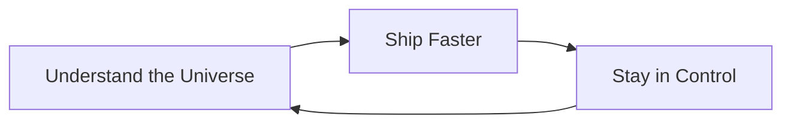

# Section 1 – Philosophy & Mental Models

> **Playbook:** [← Back to PLAYBOOK.md](../PLAYBOOK.md)  
> **Section:** 1 of 8 | **Owner:** Founder | **Cadence:** Quarterly

---

## 1.1 Why "44× Higher-Quality AI Agent Orchestration"

Most teams use AI agents as glorified autocomplete. We use them as force multipliers on every step of the product development cycle. The 44× figure is the **compound result** of applying structured discipline at every layer of the stack:

| Layer | What We Do | Multiplier |
|---|---|---|
| Issue quality | Structured, agent-ready issues with acceptance criteria | 3× |
| AGENTS.md guardrails | Every repo has a canonical instruction file | 4× |
| Prompt engineering | CoT + ReAct + self-critique patterns | 2× |
| Multi-model routing | Right model for every task | 1.5× |
| Human-in-the-loop | Review gates prevent regressions | 1.5× |
| RAG + memory | Consistent, context-aware outputs | 2× |
| **Compounded** | | **≈ 44×** |

This is not about replacing human judgment – it is about making every hour of human attention count 44× more.

---

## 1.2 Human-in-the-Loop vs. Fully Autonomous

We define five trust levels for agent autonomy:

### Default Mode: Level 2–3

For all production-affecting changes, we operate at **Level 2**. For internal tooling, docs, and tests, **Level 3** is acceptable.

**Level 4 is reserved for:**
- Auto-generated documentation updates
- Changelog generation
- Dependency version bumps (when tests pass)

**We never operate at Level 4 for:**
- Production deployments
- Database migrations
- Security-sensitive code changes
- Billing or payment logic

### Decision Matrix

| Task Type | Autonomy Level |
|---|---|
| Refactoring with full test coverage | Level 3 |
| New feature implementation | Level 2 |
| Database schema change | Level 1 |
| Production deploy | Level 1 (human initiates) |
| Documentation update | Level 3 |
| Dependency update (patch) | Level 3 |
| Dependency update (major) | Level 2 |

---

## 1.3 Our North Star

> **Understand the Universe → Ship Faster → Stay in Control**

These three principles are not sequential steps – they are a continuous loop:

### Understand the Universe

Before an agent writes a single line of code, it must understand:
- The domain deeply (business context, user needs)
- The codebase (architecture, patterns, conventions)
- The constraints (time, budget, security requirements)
- The definition of "done" (acceptance criteria)

**Failure mode to avoid:** "Vibe coding" – letting agents generate output without deep context leads to plausible-sounding but wrong solutions.

### Ship Faster

Speed comes from:
- Eliminating back-and-forth through precise upfront specification
- Automating the repetitive (boilerplate, tests, docs)
- Parallelizing work across multiple agents when tasks are independent
- Having templates ready so every new task starts at 80% done

**Key insight:** The bottleneck is rarely the agent's generation speed – it is the quality of the input (the issue, the prompt, the context).

### Stay in Control

Control mechanisms:
1. **Audit trail** – Every agent action is a Git commit with a clear message
2. **Reversibility** – Branch-based workflow; nothing goes to main without review
3. **Bounded actions** – Agents declare their plan before executing; humans can veto
4. **Cost visibility** – Per-task token budgets with alerts
5. **Escalation path** – Clear definition of when to pause and ask a human

---

## 1.4 Anti-Patterns We Actively Avoid

| Anti-Pattern | Why It's Harmful | Our Counter-Pattern |
|---|---|---|
| "Just ask the AI" (no structured issue) | Vague input → vague output | Always use the issue template |
| Agents self-merging PRs | No human oversight | Hard rule: agents cannot merge |
| One mega-prompt for complex tasks | Context overload → degraded output | Break into sub-tasks with sub-issues |
| Skipping AGENTS.md | Agent has no context about repo conventions | AGENTS.md is required in every repo |
| Treating all models as equivalent | Wrong model for task → poor quality/high cost | Follow the multi-model routing table |
| Ignoring costs | Runaway API spend | Per-task budgets enforced in orchestrator |

---

*Section 1 complete | [Next: Section 2 – The SHReye AI Stack →](02-stack.md)*
