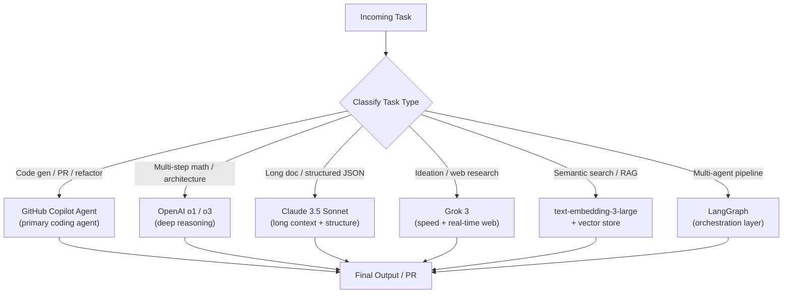
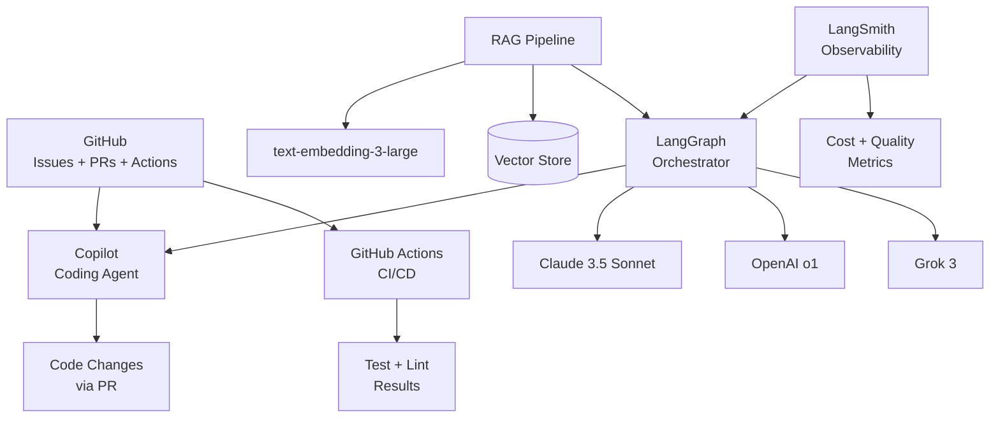

# Section 2 – The SHReye AI Stack 2026

> **Playbook:** [← Back to PLAYBOOK.md](../PLAYBOOK.md)  
> **Section:** 2 of 8 | **Owner:** Tech Lead | **Cadence:** Monthly

---

## 2.1 Core Tools

The SHReye AI stack is built around the principle of **best-in-class tools at every layer**, with clear ownership and integration contracts between them.

### Tier 1 – Foundation (Always On)

| Tool | Role | Why We Use It |
|---|---|---|
| **GitHub Copilot (Coding Agent)** | Issue → PR automation | Deep repo context, plan mode, AGENTS.md support |
| **GitHub Actions** | CI/CD pipeline | Native GitHub integration, no extra infra |
| **Claude 3.5 Sonnet** | Structured output, long context | Best-in-class instruction following, 200K context |
| **OpenAI o1 / o3** | Complex reasoning | Chain-of-thought superiority on hard problems |

### Tier 2 – Specialized (Task-Dependent)

| Tool | Role | When to Use |
|---|---|---|
| **Grok 3** | Fast ideation, web-aware tasks | When real-time internet access is needed |
| **text-embedding-3-large** | Semantic embeddings | RAG pipelines, semantic search |
| **LangGraph** | Agent orchestration | Multi-agent pipelines with state management |
| **CrewAI** | Role-based agent teams | When agent specialization by role is useful |
| **LangSmith** | Observability & eval | Tracing, eval datasets, cost tracking |

### Tier 3 – Experimental (Opt-In)

| Tool | Role | Status |
|---|---|---|
| **OpenAI Codex (future)** | Autonomous code execution | Evaluating for v1.1 |
| **Anthropic Computer Use** | GUI automation | Evaluating for v1.1 |
| **GPT-4o voice** | Voice-driven agent control | Research phase |

---

## 2.2 Multi-Model Routing Strategy



### Routing Decision Tree

```
Is this a coding task that results in a PR?
  └── YES → GitHub Copilot Agent
  └── NO → Does it require reasoning over 5+ steps?
              └── YES → OpenAI o1
              └── NO → Does it involve a document > 50 pages or strict JSON output?
                          └── YES → Claude 3.5 Sonnet
                          └── NO → Is real-time web access needed?
                                      └── YES → Grok 3
                                      └── NO → Use Claude 3.5 Sonnet as default
```

---

## 2.3 When to Use Which Model/Agent

### Detailed Scenario Guide

| Scenario | Recommended Model | Notes |
|---|---|---|
| Writing new feature code | GitHub Copilot | Provide well-structured issue + AGENTS.md |
| Refactoring existing code | GitHub Copilot | Ensure tests exist before refactoring |
| System architecture design | o1 + Claude (compare) | Use o1 for reasoning, Claude for documentation |
| Writing unit tests | GitHub Copilot | Copilot has repo context for accurate mocks |
| Summarizing long documents | Claude 3.5 Sonnet | 200K context handles large PDFs |
| Extracting structured data | Claude 3.5 Sonnet | Best instruction-following for JSON schemas |
| Research / competitive analysis | Grok 3 | Access to real-time web |
| Generating embeddings | text-embedding-3-large | For RAG pipelines and semantic search |
| Code review assistance | Claude 3.5 Sonnet | Good at identifying subtle bugs |
| Multi-agent workflow | LangGraph + specialized models | Route sub-tasks to appropriate models |
| Rapid brainstorming | Grok 3 or Claude | Use Grok for speed, Claude for structure |
| Translating requirements → specs | Claude 3.5 Sonnet | Structured, precise output |

---

## 2.4 Stack Integration Architecture



---

## 2.5 Cost Management

### Token Budget Guidelines

| Task Type | Max Tokens (Input + Output) | Approx. Cost |
|---|---|---|
| Code generation (small) | 8,000 | < $0.05 |
| Code generation (medium) | 32,000 | < $0.20 |
| Long-doc summarization | 150,000 | < $1.50 |
| Multi-agent pipeline (simple) | 50,000 aggregate | < $0.50 |
| Multi-agent pipeline (complex) | 200,000 aggregate | < $2.00 |

**Hard limits:**
- Per-task budget: $2.00 (escalate if exceeded)
- Daily budget per workspace: $50.00 (alert at 80%)
- Monthly budget: $1,000 (alert at 70%)

---

## 2.6 Adding a New Tool to the Stack

Before adding any new AI tool or model:

1. **Evaluate** – Does it outperform the current tool on our benchmark tasks?
2. **Cost** – Is the cost-per-task acceptable within our budget?
3. **Integration** – Can it be added to LangGraph without breaking existing pipelines?
4. **Security** – Does it meet our data handling requirements?
5. **Approval** – Tech Lead + Founder must approve Tier 1/2 additions

Use the sub-issue template: [Sub-Issue: Add [Tool] to SHReye AI Stack](../playbook/07-templates.md#sub-issue-template)

---

*Section 2 complete | [Next: Section 3 – Issue → Agent → PR Workflow →](03-issue-agent-pr-workflow.md)*
