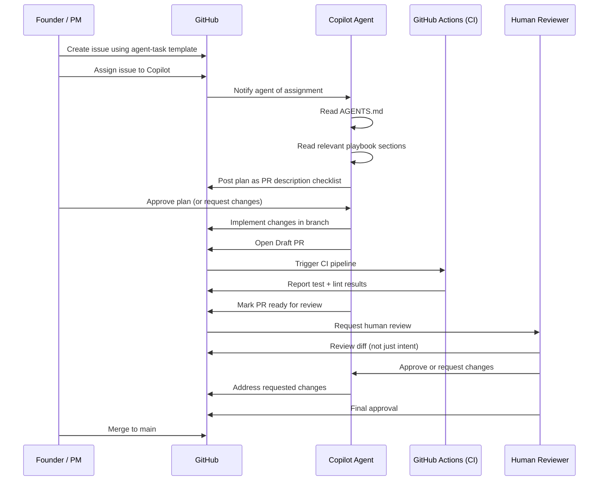

# Section 3 – Issue → Agent → PR Workflow

> **Playbook:** [← Back to PLAYBOOK.md](../PLAYBOOK.md)  
> **Section:** 3 of 8 | **Owner:** All | **Cadence:** Weekly retro

---

## 3.1 The Complete Flow

This is the exact workflow we demonstrated in the SHReye AI blog. Every agent-driven task in our repos follows this flow without exception.



---

## 3.2 How to Draft Perfect Issues for Copilot

The quality of the issue is the primary determinant of the quality of the agent's output. A well-structured issue gives Copilot everything it needs without requiring back-and-forth.

### The 7-Component Issue Formula

#### Component 1: Clear Title
- Format: `[Action Verb] [Noun] [Scope/Context]`
- ✅ `Create user authentication module with JWT support`
- ✅ `Refactor database connection pooling to use pg-pool v3`
- ❌ `Fix login` (too vague)
- ❌ `Update stuff` (meaningless)

#### Component 2: Problem Statement (Why Now)
```markdown
## Problem
[1-3 sentences: what is broken or missing, why it matters today]

Example:
Users are being logged out unexpectedly after 30 minutes. This is causing 
a 23% drop in session completion rate and support tickets are rising.
```

#### Component 3: Acceptance Criteria (Definition of Done)
```markdown
## Acceptance Criteria
- [ ] JWT tokens expire after 7 days (not 30 minutes)
- [ ] Refresh token rotation is implemented
- [ ] Existing tests pass with zero regressions
- [ ] New unit tests for token validation logic (coverage ≥ 80%)
- [ ] API documentation updated
```

#### Component 4: Technical Constraints
```markdown
## Constraints
- Stack: Node.js 20, Express 4, PostgreSQL 15
- Library: Use `jsonwebtoken` v9 (already in package.json)
- Do NOT change the `/login` endpoint signature (mobile clients depend on it)
- Must work with existing session middleware
```

#### Component 5: Examples / References
```markdown
## References
- Current behavior: `src/auth/session.ts` lines 45–67
- Target behavior: See RFC in Notion (link)
- Prior art: PR #142 (related fix for refresh tokens)
```

#### Component 6: Out of Scope
```markdown
## Out of Scope
- OAuth / social login (separate issue)
- Frontend changes (separate issue)
- Multi-factor authentication
```

#### Component 7: Labels & Metadata
```yaml
labels: [agent-ready, enhancement, priority-high]
assignees: [copilot]
milestone: Q2 2026
```

### Issue Quality Checklist

Before assigning to Copilot, verify:

- [ ] Title uses the action verb format
- [ ] Acceptance criteria are checkboxes (not prose)
- [ ] At least one code reference or file path is provided
- [ ] Out of scope section exists
- [ ] Labels include `agent-ready`

---

## 3.3 AGENTS.md Rules

Every repository must have a root-level `AGENTS.md`. This is **non-negotiable** – it is the agent's first read before any action.

### Minimum Required Sections

```markdown
# AGENTS.md

## Repository Purpose
[1-2 sentences on what this repo does]

## Agent Operating Rules
### MUST DO
- [list of required behaviors]

### MUST NOT DO
- [list of prohibited behaviors]

## File Editing Guidelines
[Table: file → editing rule]

## How to Run / Validate
[Commands to run tests, lints, builds]

## Context & References
[Links to relevant docs, playbook sections]
```

### AGENTS.md Validation Checklist

- [ ] Present at repo root
- [ ] Includes "must do" and "must not do" sections
- [ ] Includes how to run tests/lints
- [ ] Links to PLAYBOOK.md if applicable
- [ ] Updated whenever repo structure changes

See canonical starter: [../AGENTS.md](../AGENTS.md)

---

## 3.4 Plan Mode → Implement → Review Loop

### Step 1: Plan Mode

When Copilot receives an issue, it **must** generate a plan before touching any file. The plan appears as the PR description with a checklist:

```markdown
## Plan

### Files to Change
- [ ] `src/auth/session.ts` – Update token expiry from 30m to 7d
- [ ] `src/auth/refresh.ts` – Add refresh token rotation logic
- [ ] `tests/auth/session.test.ts` – Add tests for new expiry logic

### Steps
1. Read existing session.ts to understand current implementation
2. Update JWT expiry configuration
3. Implement refresh token rotation
4. Update tests
5. Run `npm test` to verify no regressions
6. Update API docs

### Risks
- Breaking change in token format: mitigated by backward-compatible migration
```

**Human action:** Review the plan. Comment with `LGTM on plan` or `Changes needed: [specific feedback]` before agent proceeds.

### Step 2: Implement

Agent implements changes following the plan:
- One logical change per commit
- Commit messages follow: `type(scope): description` (conventional commits)
- PR is opened as **Draft** until implementation is complete

### Step 3: Validate

Before marking PR ready:
- [ ] All existing tests pass
- [ ] New tests added and passing
- [ ] Linter shows zero new errors
- [ ] PR description updated with what changed and why

### Step 4: Human Review

Reviewers must review the **diff**, not just the description:
- Is the logic correct?
- Are edge cases handled?
- Is the test coverage meaningful (not just happy-path)?
- Are there any security concerns?

### Step 5: Iterate

If changes are requested:
- Agent addresses each comment explicitly
- Re-requests review
- Maximum 3 rounds of review before escalating to a synchronous discussion

---

## 3.5 Branch Naming Convention

```
agent/<issue-number>-<short-description>
```

Examples:
- `agent/42-jwt-token-expiry`
- `agent/107-refactor-db-pool`
- `copilot/create-shreye-ai-playbook-v1-0` (Copilot's default naming)

---

## 3.6 PR Description Template

```markdown
## Summary
Resolves #[issue-number]

[1-2 sentence summary of what was implemented]

## Changes Made
- `file1.ts`: [what changed and why]
- `file2.ts`: [what changed and why]

## Testing
- [ ] Existing tests pass
- [ ] New tests added: [describe what is tested]
- [ ] Manual verification: [describe how you verified]

## Acceptance Criteria
- [x] [Copy from issue and check off]
- [ ] [Unchecked = not yet complete]

## Notes for Reviewer
[Any context that would help the reviewer understand edge cases or decisions]
```

---

*Section 3 complete | [Next: Section 4 – Prompt Engineering Playbook →](04-prompt-engineering.md)*
