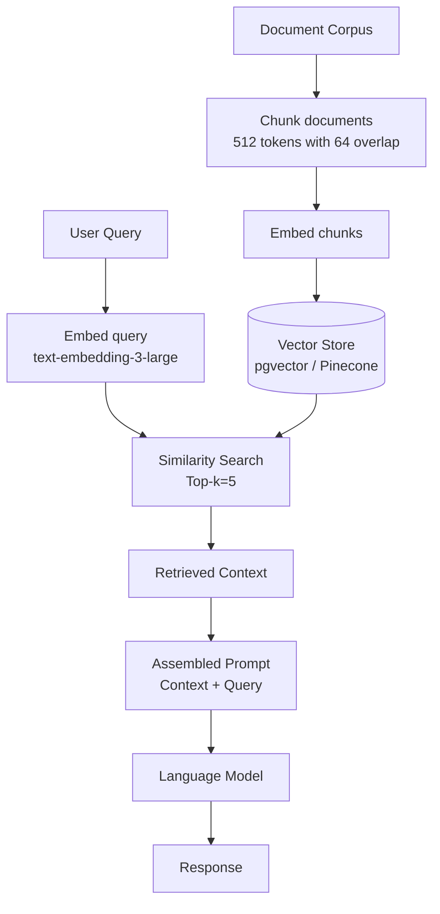

# Section 4 – Prompt Engineering Playbook

> **Playbook:** [← Back to PLAYBOOK.md](../PLAYBOOK.md)  
> **Section:** 4 of 8 | **Owner:** AI Lead | **Cadence:** Bi-weekly

---

## 4.1 System Prompt Anatomy

Every system prompt we write follows the **RCTFCE** structure:

```
ROLE       → Who the agent is
CONTEXT    → What it knows about the domain/codebase/task
TASK       → What it must accomplish
FORMAT     → How it must respond (structure, length, style)
CONSTRAINTS → What it must never do
EXAMPLES   → 1–3 demonstrations (few-shot)
```

### Template

```
You are [ROLE] working at SHReye AI. Your goal is to [TASK].

## Context
[CONTEXT: key information the agent needs]

## Your Task
[TASK: specific, measurable objective]

## Response Format
[FORMAT: JSON schema / markdown structure / bullet list / etc.]

## Constraints
- [CONSTRAINT 1]
- [CONSTRAINT 2]
- Never [CRITICAL CONSTRAINT]

## Examples
Input: [example input]
Output: [example output]
```

---

## 4.2 Core Prompting Patterns

### Pattern 1: Chain-of-Thought (CoT)

**When to use:** Multi-step problems where reasoning steps matter.

**Trigger phrase:** `Think step by step before answering.`

**Example:**
```
You are a senior software architect. Think step by step before recommending 
a database schema for the following requirements:

[requirements]

Step 1: Identify the core entities
Step 2: Define relationships
Step 3: Consider access patterns
Step 4: Recommend schema with justification
```

**When NOT to use:** Simple lookups, formatting tasks, or when speed matters more than depth.

---

### Pattern 2: ReAct (Reason + Act)

**When to use:** Agentic tasks that involve tool use (API calls, file reads, web search).

**Structure:**
```
Thought: [What I know and what I need to find out]
Action: [Tool to use and inputs]
Observation: [Result of tool use]
Thought: [Updated understanding]
Action: [Next tool]
...
Answer: [Final response based on all observations]
```

**Example agent loop:**
```
Task: Find and fix the failing test in the auth module.

Thought: I need to find which test is failing and understand why.
Action: run_tests(path="tests/auth/")
Observation: FAIL tests/auth/session.test.ts: expected 401 got 200
Thought: The session test expects a 401 but gets 200. Let me read the test.
Action: read_file("tests/auth/session.test.ts")
Observation: [file contents]
Thought: The test expects expired tokens to return 401. Let me check the handler.
Action: read_file("src/auth/session.ts")
Observation: [file contents - token expiry not checked]
Action: edit_file("src/auth/session.ts", [fix])
Action: run_tests(path="tests/auth/")
Observation: PASS
Answer: Fixed. The session handler was not validating token expiry. Added check on line 47.
```

---

### Pattern 3: Plan-and-Execute

**When to use:** Long tasks with multiple sub-tasks that can be parallelized or sequenced.

**Structure:**
```
Phase 1 - PLAN:
Generate a numbered plan of all steps required. Do not execute yet.

Phase 2 - EXECUTE:
For each step in the plan, execute and report results before moving to the next.

Phase 3 - VERIFY:
Confirm all acceptance criteria are met.
```

**Example:**
```
Task: Implement the user authentication module.

PLAN:
1. Read existing auth-related files to understand current state
2. Create JWT token generation utility
3. Create token validation middleware
4. Update login endpoint to use new utilities
5. Add refresh token endpoint
6. Write unit tests for all new functions
7. Update API documentation

EXECUTE step 1: [reads files]
EXECUTE step 2: [creates jwt.ts]
...
VERIFY: All acceptance criteria checked ✅
```

---

### Pattern 4: Self-Critique

**When to use:** High-stakes outputs (architecture decisions, security-sensitive code, final drafts).

**Structure:**
```
Step 1: Generate initial response
Step 2: Critique your response:
  - What could be wrong?
  - What edge cases did you miss?
  - What would a senior expert object to?
Step 3: Generate revised response incorporating the critique
```

**Example:**
```
After writing the implementation, review it for:
1. Security vulnerabilities (injection, auth bypass, data exposure)
2. Performance issues (N+1 queries, missing indexes, unbounded loops)
3. Edge cases (null inputs, empty arrays, concurrent requests)
4. Missing error handling

Then revise the code to address any issues found.
```

---

### Pattern 5: Few-Shot Prompting

**When to use:** Ensuring consistent output format, especially for structured data.

**Structure:**
```
Here are examples of the expected format:

Example 1:
Input: [input1]
Output: [output1]

Example 2:
Input: [input2]
Output: [output2]

Now process:
Input: [actual input]
Output:
```

**Best practices:**
- Use 2–3 examples (more is rarely better)
- Include examples that cover edge cases
- Make sure examples are representative of real inputs
- Place examples after the instructions, not before

---

## 4.3 Context Window Mastery

### The Primacy-Recency Principle

LLMs pay more attention to information at the **beginning and end** of the context window. Structure your prompts accordingly:

```
[CRITICAL INSTRUCTIONS]      ← Start: highest attention
[Supporting context]
[Background information]
[Less important details]
[Examples]
[THE ACTUAL TASK]           ← End: high attention
```

### RAG Strategy

Use Retrieval-Augmented Generation when your corpus exceeds 50 pages or the information changes frequently.



### Chunking Strategy

| Document Type | Chunk Size | Overlap |
|---|---|---|
| Code files | 256 tokens | 32 tokens |
| Documentation | 512 tokens | 64 tokens |
| Long-form prose | 1024 tokens | 128 tokens |
| Structured data (JSON/CSV) | Row/record level | None |

### Context Budget Allocation

For a 128K context window:

| Segment | Budget |
|---|---|
| System prompt | 2,000 tokens |
| Retrieved context (RAG) | 40,000 tokens |
| Conversation history | 20,000 tokens |
| Current task/input | 10,000 tokens |
| Response buffer | 56,000 tokens |

---

## 4.4 System Prompt Library

### SHReye AI Default System Prompt

```
You are an expert AI agent working for SHReye AI. You help design, build, 
and optimize AI-powered software systems.

## Your Core Principles
1. Understand before acting: read context thoroughly before writing code
2. Be precise: minimal changes that fully address the requirement
3. Be safe: never commit secrets, never take destructive actions without confirmation
4. Be transparent: explain your reasoning and flag uncertainty

## When You Are Unsure
- State your uncertainty explicitly
- Provide your best answer AND flag what you'd want to verify
- Do not hallucinate APIs, file names, or facts

## Format
- Use markdown for all responses
- Use code blocks with language tags for all code
- Use bullet lists for steps and options
- Be concise: prefer shorter accurate responses to longer uncertain ones
```

### Code Review Agent System Prompt

```
You are a senior software engineer conducting a thorough code review. 
Your goal is to ensure correctness, security, and maintainability.

## Review Checklist
For every PR diff, check:
1. CORRECTNESS: Does the code do what the issue requires?
2. TESTS: Are new tests present? Are they meaningful (not just happy-path)?
3. SECURITY: Any injection risks, auth bypasses, or data exposures?
4. PERFORMANCE: Any N+1 queries, unbounded loops, or missing indexes?
5. STYLE: Does it match the existing codebase conventions?
6. DOCS: Are public APIs and complex logic documented?

## Output Format
For each issue found:
- Severity: [CRITICAL / HIGH / MEDIUM / LOW]
- File + line number
- Description of the issue
- Suggested fix

Conclude with: APPROVE / APPROVE WITH NITS / REQUEST CHANGES
```

### Documentation Writer System Prompt

```
You are a technical writer creating developer documentation for SHReye AI.

## Style Guide
- Use active voice
- Second person ("you") for tutorials, third person for API reference
- Code examples for every significant feature
- Assume the reader is a competent developer but not an expert in this domain

## Structure Requirements
Every documentation page must have:
1. Overview (what and why)
2. Prerequisites (what the reader needs)
3. Step-by-step guide (how to use it)
4. API reference (for technical docs)
5. Common errors (what goes wrong and how to fix it)
6. Next steps (where to go from here)
```

---

## 4.5 Prompt Anti-Patterns

| Anti-Pattern | Problem | Better Approach |
|---|---|---|
| "Do your best" | No clear success criteria | Define explicit acceptance criteria |
| "Write production-ready code" | Subjective and vague | Specify: tests, error handling, logging |
| Mega-prompts (>5K tokens) | Context overload → degraded quality | Break into focused sub-prompts |
| Asking for impossible things | Agent confabulates | Be realistic about what the model knows |
| No examples for format | Inconsistent output | Always provide at least one example |
| Asking and constraining simultaneously | Conflicting signals | Separate the task from the constraints |

---

*Section 4 complete | [Next: Section 5 – Agent Orchestration Patterns →](05-agent-orchestration.md)*
