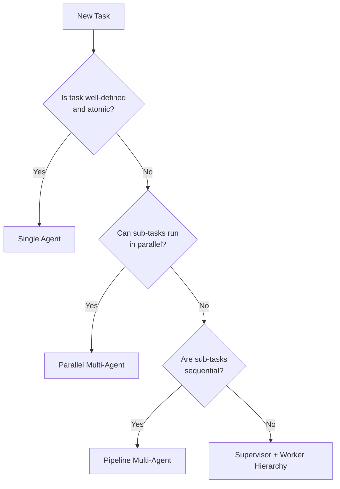
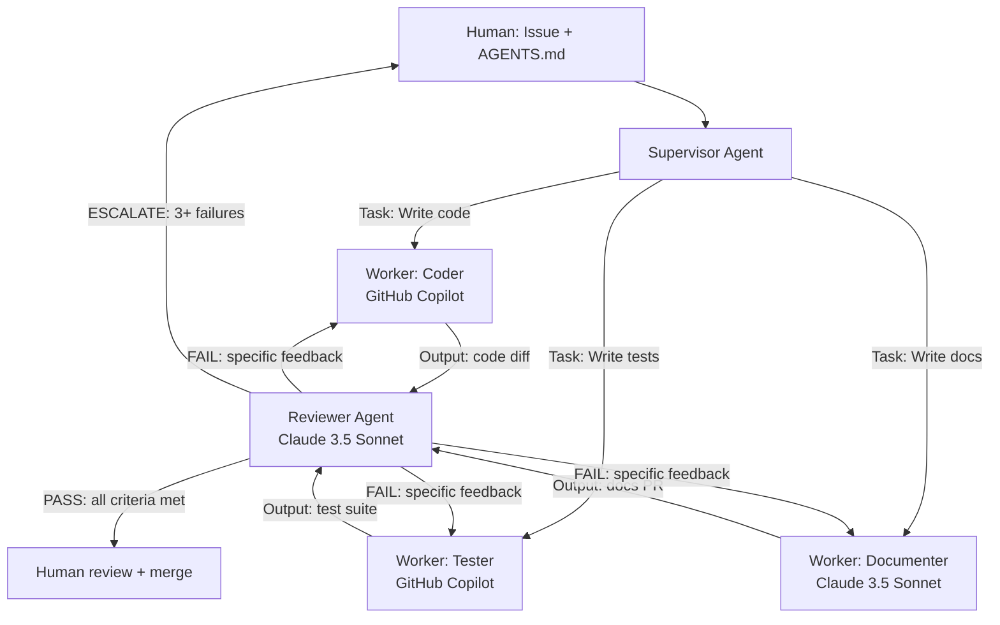
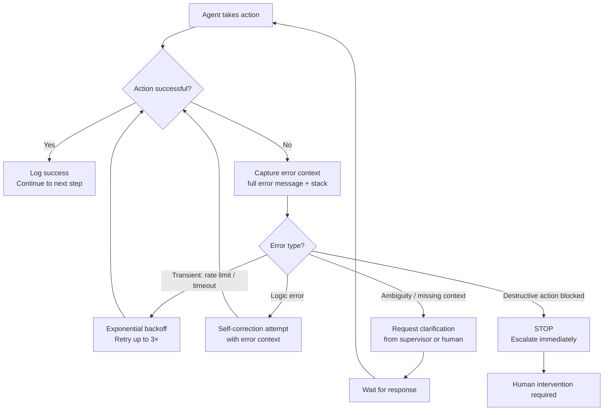
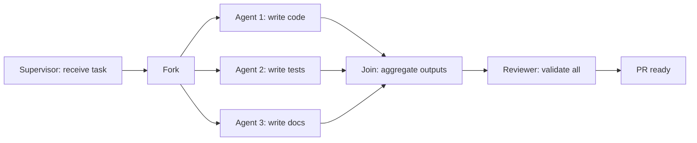
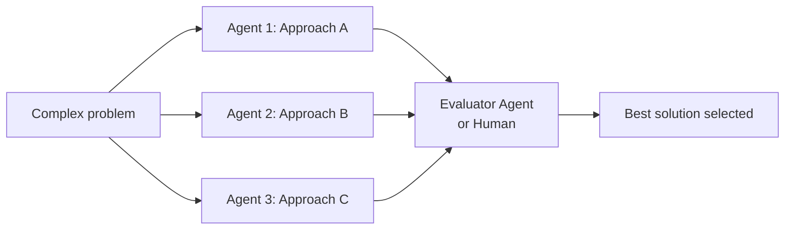

# Section 5 – Agent Orchestration Patterns

> **Playbook:** [← Back to PLAYBOOK.md](../PLAYBOOK.md)  
> **Section:** 5 of 8 | **Owner:** AI Lead | **Cadence:** Monthly

---

## 5.1 Single Agent vs. Multi-Agent Teams

Choosing the right architecture is the most important orchestration decision. More agents ≠ better results.



### When to Use Each Architecture

| Architecture | Use Case | Example |
|---|---|---|
| **Single Agent** | Atomic, well-defined tasks | "Write tests for auth module" |
| **Parallel Agents** | Independent sub-tasks | "Simultaneously: write code + write docs + write tests" |
| **Pipeline** | Sequential dependencies | "Research → Summarize → Format → Publish" |
| **Supervisor + Workers** | Complex tasks with quality gates | "Build feature" with Coder + Reviewer + Tester |
| **Swarm** | Exploration / competitive eval | "3 agents propose solutions, pick the best" |

### Architecture Decision Matrix

| Factor | Single | Parallel | Pipeline | Supervisor |
|---|---|---|---|---|
| Task complexity | Low | Medium | Medium | High |
| Setup overhead | Minimal | Medium | Medium | High |
| Token cost | Lowest | Higher | Medium | Highest |
| Output quality | Baseline | High (parallel wins) | Good | Highest |
| Failure recovery | Simple | Independent | Checkpoint | Supervised |

---

## 5.2 Supervisor → Worker → Reviewer Hierarchy

This is our primary pattern for complex coding tasks.



### Supervisor Agent Responsibilities

1. **Decompose** the issue into atomic sub-tasks
2. **Assign** each sub-task to the appropriate worker
3. **Sequence** tasks (parallel where possible, sequential where required)
4. **Aggregate** worker outputs
5. **Escalate** to human when retry limit is reached

### Worker Agent Responsibilities

1. **Accept** a single, well-scoped task
2. **Execute** using available tools
3. **Validate** own output before returning
4. **Report** completion with evidence (test results, file diffs)
5. **Request clarification** if task is ambiguous (do not guess)

### Reviewer Agent Responsibilities

1. **Validate** output against acceptance criteria
2. **Run** automated checks (tests, lints)
3. **Provide specific feedback** (file + line + what to change)
4. **Track retry count** and escalate at threshold
5. **Never approve** output that fails acceptance criteria

---

## 5.3 Error Handling, Self-Correction & Human Escalation

### Error Handling Flow



### Self-Correction Prompt Template

When an agent encounters a logic error, it re-prompts itself with:

```
## Previous Attempt Failed

Task: [original task]
Error: [exact error message]
My approach: [what I tried]

## Self-Correction

Step 1: Why did this fail?
[agent reasons about root cause]

Step 2: What alternative approach should I try?
[agent proposes different solution]

Step 3: What am I confident vs. uncertain about?
[agent flags uncertainty]

## Revised Attempt
[agent executes revised approach]
```

### Escalation Triggers

| Trigger | Action |
|---|---|
| 3 consecutive failures on same step | Escalate to human with full context |
| Confidence score < 0.7 on critical step | Request human verification |
| Detected destructive action (delete, drop table, deploy) | STOP, require explicit human approval |
| Cost exceeds per-task budget | Pause and alert |
| Conflicting instructions in context | Request clarification before proceeding |
| Security-sensitive code change | Flag for mandatory security review |

### Human Escalation Message Template

```
## Agent Escalation Required

**Task:** [issue number + title]
**Step that failed:** [specific step]
**Failure count:** [N of 3]

**What I tried:**
1. [attempt 1]
2. [attempt 2]
3. [attempt 3]

**Error detail:**
[exact error]

**What I need from you:**
[ ] Clarification: [specific question]
[ ] Different approach: [what I'd try if you tell me X]
[ ] Take over: [hand off the task]

**Context for handoff:**
[current state of files, what's done, what's not]
```

---

## 5.4 Parallel Agent Patterns

### Fork-Join (Independent Parallel Tasks)



**Implementation note:** Agents must be given isolated file scopes to avoid conflicts. The supervisor pre-assigns which files each agent owns.

### Swarm (Competitive Evaluation)



Use the swarm pattern for:
- Architectural decisions
- Algorithm selection
- Prompt optimization (generate N prompts, eval which performs best)

---

## 5.5 LangGraph Implementation Pattern

Our canonical multi-agent implementation uses LangGraph for state management:

```python
from langgraph.graph import StateGraph, END
from typing import TypedDict, List

class AgentState(TypedDict):
    issue: str
    plan: List[str]
    code_output: str
    test_output: str
    review_result: str
    retry_count: int
    escalated: bool

def supervisor(state: AgentState) -> AgentState:
    """Decompose issue into plan"""
    ...

def coder(state: AgentState) -> AgentState:
    """Implement the plan"""
    ...

def tester(state: AgentState) -> AgentState:
    """Write and run tests"""
    ...

def reviewer(state: AgentState) -> AgentState:
    """Review outputs against criteria"""
    ...

def should_retry(state: AgentState) -> str:
    if state["review_result"] == "PASS":
        return "done"
    elif state["retry_count"] >= 3:
        return "escalate"
    else:
        return "retry"

# Build graph
workflow = StateGraph(AgentState)
workflow.add_node("supervisor", supervisor)
workflow.add_node("coder", coder)
workflow.add_node("tester", tester)
workflow.add_node("reviewer", reviewer)

workflow.set_entry_point("supervisor")
workflow.add_edge("supervisor", "coder")
workflow.add_edge("coder", "tester")
workflow.add_edge("tester", "reviewer")
workflow.add_conditional_edges(
    "reviewer",
    should_retry,
    {
        "done": END,
        "retry": "coder",
        "escalate": END  # trigger human notification
    }
)

app = workflow.compile()
```

---

## 5.6 Observability Requirements

Every multi-agent pipeline must emit:

| Signal | What to Log | Tool |
|---|---|---|
| Task start | Issue ID, model, input tokens | LangSmith |
| Each agent action | Tool call + result + latency | LangSmith |
| Retry events | Retry count + error context | LangSmith + alert |
| Escalations | Full context for human | LangSmith + Slack |
| Task completion | Success/fail + total cost + latency | LangSmith + metrics DB |

---

*Section 5 complete | [Next: Section 6 – Repo Hygiene & Standards →](06-repo-hygiene.md)*
