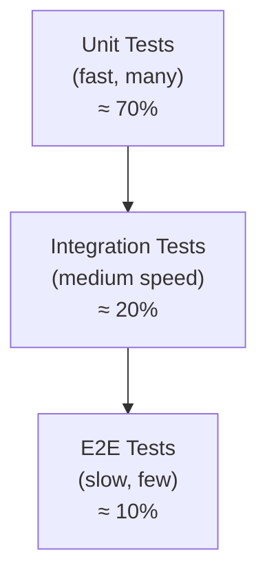
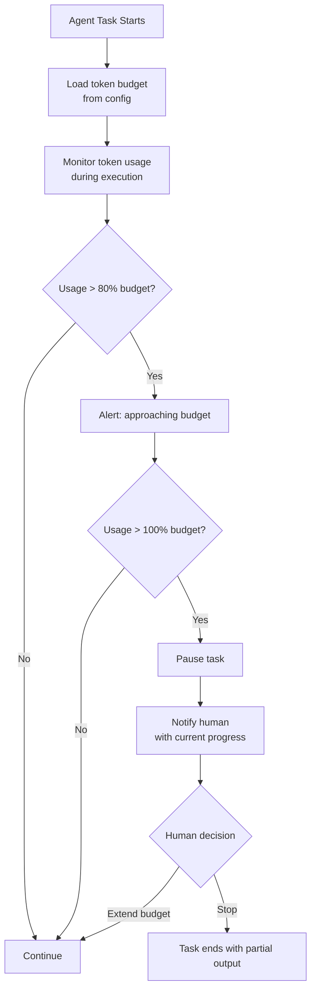

# Section 6 – Repo Hygiene & Standards

> **Playbook:** [← Back to PLAYBOOK.md](../PLAYBOOK.md)  
> **Section:** 6 of 8 | **Owner:** Tech Lead | **Cadence:** Monthly

---

## 6.1 Standard File Structure

Every SHReye AI repository follows this canonical structure. Deviations must be documented in the repo's `AGENTS.md`.

```
repo-root/
├── AGENTS.md                    # Required: AI agent instructions
├── PLAYBOOK.md                  # Or: link to central playbook
├── README.md                    # Human-facing introduction
├── CHANGELOG.md                 # All notable changes, versioned
├── .gitignore                   # Standard ignores for the stack
├── .github/
│   ├── ISSUE_TEMPLATE/
│   │   ├── agent-task.md        # Template for agent-assigned issues
│   │   ├── bug-report.md        # Template for bug reports
│   │   └── feature-request.md  # Template for feature requests
│   ├── workflows/
│   │   ├── ci.yml               # Lint + test on every PR
│   │   └── release.yml          # Versioned release workflow
│   └── PULL_REQUEST_TEMPLATE.md # PR description template
├── playbook/                    # Detailed playbook sections (this repo)
├── src/                         # Application source code
│   ├── index.ts                 # Entry point
│   └── [feature-modules]/       # One folder per domain
├── tests/                       # Test suite (mirrors src/ structure)
│   ├── unit/
│   ├── integration/
│   └── e2e/
└── docs/                        # Additional documentation
    ├── architecture.md
    └── api-reference.md
```

### File Naming Conventions

| Type | Convention | Example |
|---|---|---|
| TypeScript/JavaScript | `kebab-case.ts` | `auth-service.ts` |
| Python | `snake_case.py` | `auth_service.py` |
| React components | `PascalCase.tsx` | `AuthButton.tsx` |
| Test files | `[name].test.[ext]` | `auth-service.test.ts` |
| Markdown docs | `kebab-case.md` | `api-reference.md` |
| Config files | `[tool].[ext]` | `.eslintrc.json` |

---

## 6.2 Git Standards

### Commit Message Format (Conventional Commits)

```
<type>(<scope>): <short description>

[optional body]

[optional footer: Fixes #issue-number]
```

**Types:**
| Type | When to Use |
|---|---|
| `feat` | New feature |
| `fix` | Bug fix |
| `refactor` | Code change that is neither feature nor fix |
| `test` | Adding or updating tests |
| `docs` | Documentation only |
| `chore` | Build process, dependencies, tooling |
| `perf` | Performance improvement |

**Examples:**
```
feat(auth): add JWT refresh token rotation

fix(db): resolve connection pool exhaustion under load
Fixes #142

docs(playbook): update prompt engineering section with few-shot examples

test(auth): add edge case tests for expired token handling
```

### Branch Naming

| Branch Type | Pattern | Example |
|---|---|---|
| Agent task | `agent/<issue>-<description>` | `agent/42-jwt-refresh` |
| Feature (human) | `feature/<description>` | `feature/dark-mode` |
| Bug fix | `fix/<issue>-<description>` | `fix/99-null-pointer-login` |
| Playbook update | `playbook/<section>-<description>` | `playbook/section-4-few-shot` |
| Release | `release/v<version>` | `release/v1.2.0` |

### Protected Branch Rules

`main` branch must have:
- [ ] Require PR before merging (no direct push)
- [ ] Require at least 1 approving review
- [ ] Require status checks to pass (CI must be green)
- [ ] Do not allow bypassing these rules (including admins)

---

## 6.3 Testing Requirements for Agent PRs

### Minimum Requirements

Every agent-generated PR **must** satisfy all of the following before human review:

```
Functional Requirements:
  ✅ All pre-existing tests pass (zero regressions)
  ✅ New functions/methods have corresponding unit tests
  ✅ New test coverage ≥ 80% for changed files
  ✅ Integration tests pass for affected endpoints/modules

Code Quality:
  ✅ Linter reports zero new errors (warnings acceptable)
  ✅ No console.log / print statements left in production code
  ✅ No commented-out code blocks
  ✅ No TODO comments without associated GitHub issue numbers

Security:
  ✅ No hardcoded credentials or secrets
  ✅ No new dependencies with known critical vulnerabilities
  ✅ Input validation present on all new public APIs
```

### Testing Pyramid



### CI Pipeline Requirements

Every repository must have a CI workflow that runs on every PR:

```yaml
# .github/workflows/ci.yml (example structure)
name: CI

on:
  pull_request:
    branches: [main]

jobs:
  lint:
    runs-on: ubuntu-latest
    steps:
      - uses: actions/checkout@v4
      - name: Lint
        run: [lint command for your stack]

  test:
    runs-on: ubuntu-latest
    steps:
      - uses: actions/checkout@v4
      - name: Test
        run: [test command for your stack]
      - name: Coverage check
        run: [coverage threshold command]

  security:
    runs-on: ubuntu-latest
    steps:
      - uses: actions/checkout@v4
      - name: Security audit
        run: [dependency audit command]
```

---

## 6.4 Security & Cost Guardrails

### Security Guardrails

| Guardrail | Implementation | Enforcement |
|---|---|---|
| No hardcoded secrets | `.gitignore` + pre-commit hook + GitHub secret scanning | Automated (blocks PR) |
| Dependency vulnerability scan | `npm audit` / `pip audit` / `cargo audit` in CI | Automated (blocks merge on HIGH+) |
| Destructive action gate | Human approval required in agent escalation flow | Process (agent protocol) |
| Structured output validation | Pydantic / Zod schemas on all AI outputs | Code (enforced in code) |
| Rate limiting on APIs | Exponential backoff wrapper on all external calls | Code (enforced in code) |
| Least-privilege API keys | Scoped keys per environment, rotated quarterly | Ops process |

### Pre-commit Hook Requirements

Every developer machine must have these pre-commit checks:

```yaml
# .pre-commit-config.yaml
repos:
  - repo: https://github.com/pre-commit/pre-commit-hooks
    hooks:
      - id: detect-private-key
      - id: check-added-large-files
        args: ['--maxkb=500']
      - id: no-commit-to-branch
        args: ['--branch', 'main']
  - repo: https://github.com/gitleaks/gitleaks
    hooks:
      - id: gitleaks
```

### Cost Guardrails



### Cost Configuration Template

```json
{
  "cost_guardrails": {
    "per_task_limit_usd": 2.00,
    "alert_threshold_pct": 80,
    "daily_limit_usd": 50.00,
    "daily_alert_pct": 80,
    "monthly_limit_usd": 1000.00,
    "monthly_alert_pct": 70
  }
}
```

---

## 6.5 Documentation Standards

### Every Public API Must Have

```markdown
## `functionName(param1: type, param2: type): ReturnType`

**Description:** [What it does and why]

**Parameters:**
- `param1` – [Description, valid values, constraints]
- `param2` – [Description, valid values, constraints]

**Returns:** [What is returned and in what format]

**Throws:** [Errors that can be raised and when]

**Example:**
\`\`\`typescript
const result = functionName(value1, value2);
\`\`\`
```

### README Requirements

Every repo README must include:
1. What this repo does (1-2 sentences)
2. Quick start (≤ 5 commands to get running)
3. Link to detailed docs / playbook
4. Link to AGENTS.md (for agent-aware repos)
5. Link to CHANGELOG.md

---

*Section 6 complete | [Next: Section 7 – Templates & Ready-to-Use Assets →](07-templates.md)*
