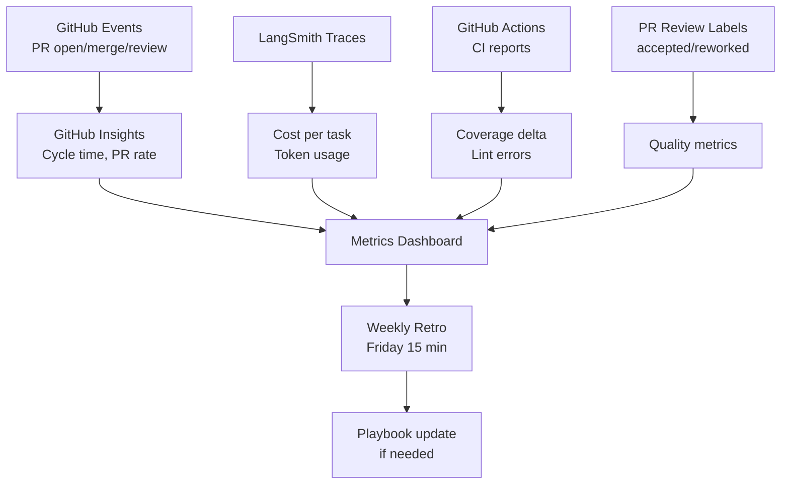
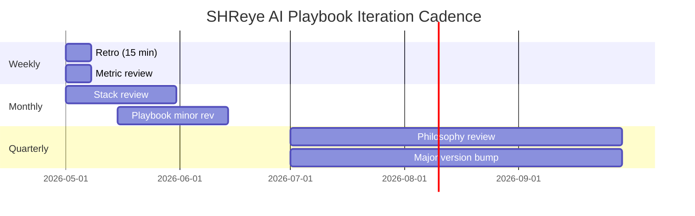
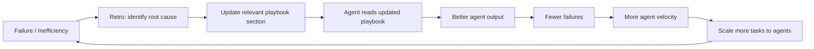

# Section 8 – Metrics & Iteration

> **Playbook:** [← Back to PLAYBOOK.md](../PLAYBOOK.md)  
> **Section:** 8 of 8 | **Owner:** Founder + AI Lead | **Cadence:** Weekly

---

## 8.1 How We Measure Agent Velocity

Metrics are the feedback loop that improves the playbook. We track at three levels:

### Level 1 – Task Metrics (per PR)

| Metric | Definition | Target | Data Source |
|---|---|---|---|
| **Cycle time** | Issue created → PR merged | < 2 hours | GitHub Insights |
| **PR acceptance rate** | PRs merged without major rework | > 80% | PR labels: `accepted` / `reworked` |
| **Rework rate** | PRs that needed > 2 review rounds | < 20% | PR review count |
| **Test coverage delta** | Coverage change introduced by PR | ≥ 0% (never lower) | CI coverage report |
| **Hallucination rate** | Incorrect implementations caught in review | < 5% | Reviewer log |
| **Cost per task** | API token cost for the agent run | < $0.50 | LangSmith traces |

### Level 2 – Weekly Aggregate Metrics

| Metric | Target | Alert Threshold |
|---|---|---|
| Agent PRs opened per week | Trending up | Drop > 30% week-over-week |
| Agent PRs merged per week | Trending up | Drop > 30% week-over-week |
| Average cycle time (weekly) | < 2 hours | > 4 hours |
| Total agent API cost (weekly) | < $200 | > $350 |
| Escalations to human | < 3 per week | > 5 per week |

### Level 3 – Monthly Quality Metrics

| Metric | Target | Review |
|---|---|---|
| Production incidents from agent PRs | 0 per month | Post-mortems if any |
| Playbook sections updated | ≥ 1 per month | Playbook retro |
| New agent capabilities added to stack | ≥ 1 per quarter | Stack review |
| Onboarding time for new team member | < 1 day | New hire survey |

---

## 8.2 Metric Collection Implementation



### GitHub Labels for Metric Tracking

Add these labels to PRs to enable quality metric collection:

| Label | When to Apply |
|---|---|
| `agent-pr` | Any PR opened by Copilot or another agent |
| `accepted` | PR merged with no major rework requested |
| `reworked` | PR needed > 2 rounds of significant review changes |
| `escalated` | Agent escalated to human during implementation |
| `hallucination` | Reviewer caught an incorrect implementation |
| `playbook-update` | PR updates the playbook |

---

## 8.3 Weekly Playbook Retro Process

Every Friday, a 15-minute sync (async-first: post in Slack before meeting):

### Retro Template

```markdown
## SHReye AI Weekly Retro – [Date]

### 🏆 Agent Wins This Week
- [PR/issue that went exceptionally well and why]

### 🔴 Agent Failures / Escalations
- [What failed, what we had to fix manually, root cause if known]

### 💰 Cost Report
- Total agent API spend this week: $X
- Highest cost single task: $X (issue #N)
- Cost trend vs. last week: ↑ / ↓ / →

### 📊 Velocity
- Agent PRs opened: N
- Agent PRs merged: N
- Average cycle time: X hours
- Rework rate: X%

### 📖 Playbook Updates Needed?
- [ ] [Section] – [What needs to change and why]
- [ ] (none this week)

### 🔮 Next Week Focus
- [1-3 specific improvements to the workflow]
```

### Retro Output → Playbook Update Process

1. Identify playbook sections that need updating (from retro)
2. Open a GitHub issue with label `playbook`
3. Assign to Copilot (for wording improvements) or relevant human (for strategic changes)
4. Merge with one human approval
5. Bump playbook MINOR version

---

## 8.4 Iteration Cadence



---

## 8.5 Continuous Improvement Flywheel

The playbook is a living document. Every failure becomes a playbook update. Every update improves agent quality. Every quality improvement reduces failures.



---

## 8.6 OKRs for SHReye AI Agent Operations (Q2 2026)

### Objective: Achieve 10× developer output with AI agents

| Key Result | Target | Current | Status |
|---|---|---|---|
| Average issue → merge cycle time | < 2 hours | (baseline) | 🟡 Establishing |
| % of routine tasks completed by agents | > 60% | (baseline) | 🟡 Establishing |
| Agent PR acceptance rate | > 80% | (baseline) | 🟡 Establishing |
| Total monthly API cost | < $1,000 | (baseline) | 🟡 Establishing |
| Playbook version | 1.0 shipped | 1.0 ✅ | 🟢 Done |

---

*Section 8 complete | [← Back to PLAYBOOK.md](../PLAYBOOK.md)*

---

*SHReye AI Playbook v1.0 – Section 8: Metrics & Iteration*  
*North Star: Understand the Universe → Ship Faster → Stay in Control* 🚀
